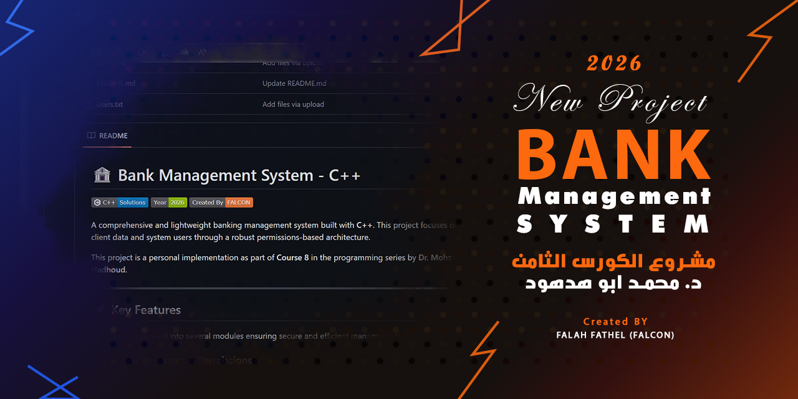

  

# 🏦 Bank Management System FP (Functional Programming) - C++

  
  
  

A comprehensive and lightweight banking management system built with **C++**. This project focuses on managing client data and system users through a robust permissions-based architecture.

> [!NOTE]
> This project is a personal implementation as part of **Course 8** in the programming series by **Dr. Mohammed Abu-Hadhoud**.

---

## 🚀 Key Features

### 1. User Management & Permissions
* **Secure Login:** Features a login screen requiring a username and password with a maximum of 3 attempts.
* **Granular Permissions:** Specific access control for:
    * Show Clients | Add/Delete/Update Clients | Find Clients | Transactions | User Management.
* **Admin Protection:** Built-in safeguards prevent the deletion of the 'Admin' user.

### 2. Client Management
* **Unique Records:** Validates Account Numbers to ensure no duplicates.
* **Soft Deletes:** Maintain data integrity while removing records.
* **Instant Search:** Find clients by Account Number or Name.

### 3. Transaction Module
* **Real-time Updates:** Deposit and withdraw with instant balance calculation.
* **Balance Validation:** Prevents withdrawals exceeding the available credit.
* **Summary Reports:** View total balances for all clients at once.

### 4. Data Persistence
* **File-Based Storage:** Data is saved in `.txt` files, ensuring it's preserved after closing the program.

---

## 🛠 Technical Stack & Concepts

* **Vectors & Structs:** Efficient dynamic memory management.
* **File Handling (fstream):** Persistent storage implementation.
* **Enums:** For clean navigation and application state management.
* **ASCII Art:** Custom "FALCON" branding within the source code.

---

## ⚠️ Important Setup (Prerequisites)

To run the program successfully, ensure the following:

1.  **Mandatory Files:** Download/Create `Clients.txt` and `Users.txt`.
2.  **File Path:** Place these files in the **same directory** as the source code or executable.
3.  **Automatic Loading:** The system reads these files immediately upon startup.

---

## 📋 Project Roadmap

### Current Limitations
- Reliance on flat `.txt` files (not suitable for massive data).
- No concurrency support for multiple users.
- Plain text storage (Educational level security).

### Future Improvements
- [ ] **Database Integration:** Transition to SQLite or MySQL.
- [ ] **Data Encryption:** Implement SHA-256 for passwords.
- [ ] **GUI:** Transition from Console to a modern interface (Qt/SFML).
- [ ] **Transaction Logs:** Detailed history (Date/Time/Amount).

---

## 👨‍💻 Developed By
**Falah Fathel (FALCON)**
* **Year:** 2026
* **Educational Reference:** Course 8 - Dr. Mohammed Abu-Hadhoud

---

### 📝 License
This project is intended for educational purposes and to demonstrate proficiency in C++ programming logic.
